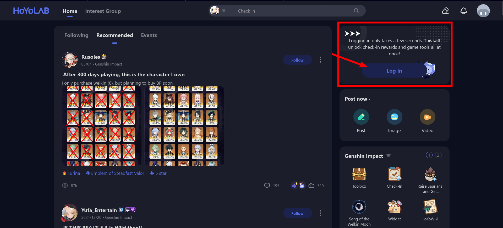
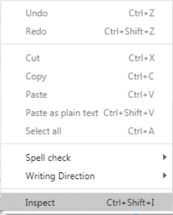

# What is this tool?

This tool aims to help people who want to more easily import all characters along with
levels, weapons and weapon levels from Genshin Impact for use in websites like [Genshin
Optimizer](https://frzyc.github.io/genshin-optimizer/#/). It does so by converting the
already available info from Hoyolab's "Battle Chronicles" page into a format known as
[.good](https://frzyc.github.io/genshin-optimizer/#/doc), which is, in essence, just
`.json`.

Following are the steps to do in order to import successfully:

### Step 0

Go to the [Hoyolab website](https://www.hoyolab.com/) and ensure you are logged in with
the account you want to import from.

### Step 1

Select the "Genshin Impact" tab at the top, if it's not already selected, and click the
"Battle Chronicles" button.

### Step 2

Ensure the page is in english, since the data will also be localized if you don't do
that, breaking the compatibility with the `.GOOD` format.

### Step 3

Open your browser's "Developer tools". Depending on your browser, this can be done by
either pressing the following hotkeys:

- **Chrome/Edge/Brave**: `Ctrl + Shift + I` (Windows/Linux) or `Cmd + Option + I` (Mac)
- **Firefox**: `Ctrl + Shift + I` (Windows/Linux) or `Cmd + Option + I` (Mac)
- **Safari**: `Cmd + Option + I` (Mac)

Or by right-clicking anywhere in the page and clicking the "Inspect" or "Inspect
Element" option.

### Step 4

Select the "Network" tab in the devtools (May need to click the expand icon to view full
list) and refresh the page.

### Step 5

Filter list by `/list`, right-click the only result (if multiple appear, right-click the
one with the largest filesize) and navigate the menu to find the "Copy response" button,
which you should click.

### Step 6

Now go back to this site and paste what you've just copied in the "Input" area and click
convert.

### Step 7

The output area will then display the converted `.good` file, which you can copy and
paste where you need.

